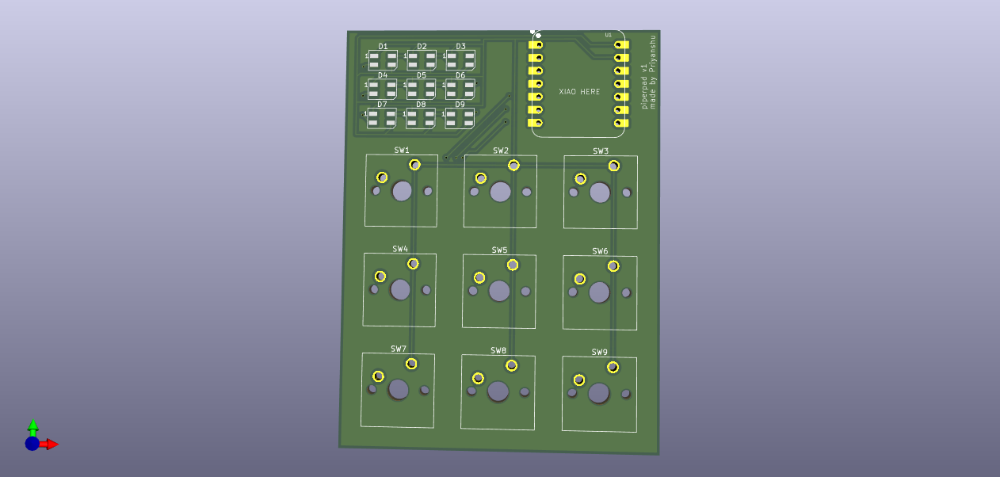
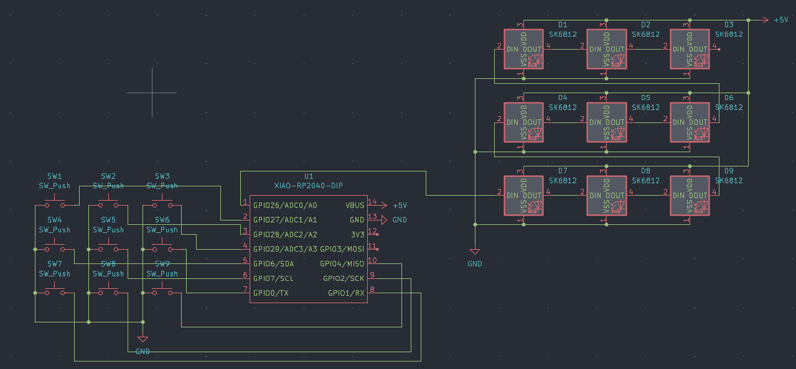
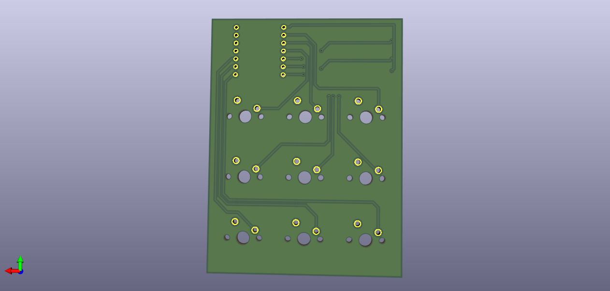
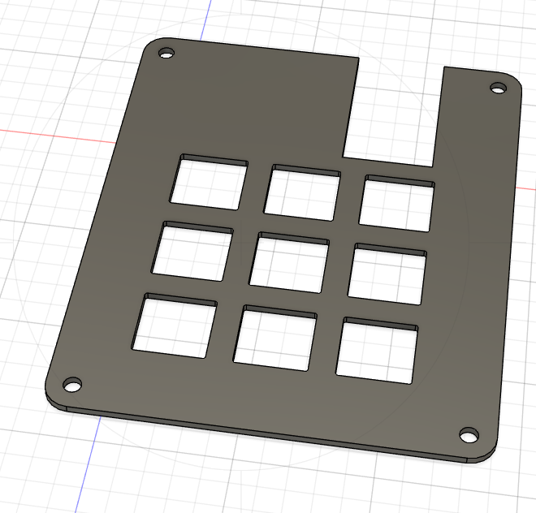
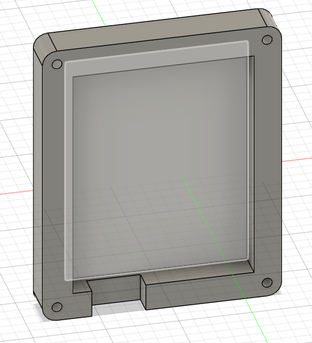

# PiperPad

a tiny 3×3 hackpad with per-key RGB light. 
Each of the 9 keys has its own RGB LED. Instead of just pressing buttons, you can enter **sequences** and **patterns** that unlock behaviors, layers, or macros.
It is built to make secure passcode patterns with different Led lights.

---

## Hackpad Overview

---

## Schematic

---

## PCB

**Front:**

**Back:**

---

## Case Design

**Top:**

**Bottom:**

---

## Firmware

> Firmware is not complete only test code for now, will update code when I get physical materials to work on.

Pz~